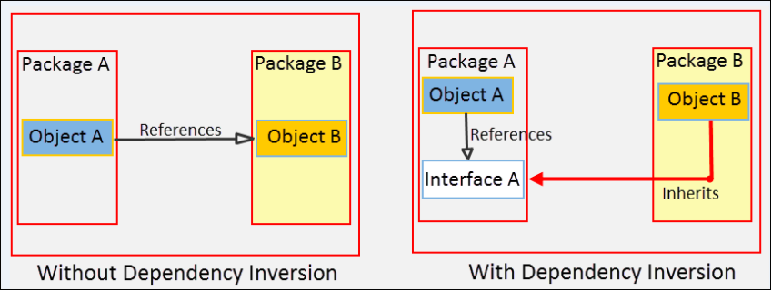

# SOLID principles

* Single Responsibility
* Open / Closed
* Liskov Substitution
* Interface Segregation
* Dependency Inversion


## Single Responsibility:

The classes you write, should not be a swiss army knife. They should do one thing, and do that one thing well.


#### (Bad) Example

```java
class Text {
    String text;
    String author;
    int length;

    String getText() { ... }
    void setText(String s) { ... }
    String getAuthor() { ... }
    void setAuthor(String s) { ... }
    int getLength() { ... }
    void setLength(int k) { ... }

    /*methods that change the text*/
    void allLettersToUpperCase() { ... }
    void findSubTextAndDelete(String s) { ... }

    /*method for formatting output*/
    void printText() { ... }
}
```
At first glance, this class might look correctly written. However, it contradicts the single responsibility principle, in that it has multiple reasons to change: we have two methods which change the text itself, and one which prints the text for the user. If any of these methods is called, the class will change. This is also not good because it mixes the logic of the class with the presentation.

#### Better Example
One way of fixing this is writing another class whose only concern is to print text. This way, we will separate the functional and the “cosmetic” parts of the class.

```java
class Text {
    String text;
    String author;
    int length;

    String getText() { ... }
    void setText(String s) { ... }
    String getAuthor() { ... }
    void setAuthor(String s) { ... }
    int getLength() { ... }
    void setLength(int k) { ... }

    /*methods that change the text*/
    void allLettersToUpperCase() { ... }
    void findSubTextAndDelete(String s) { ... }
}

class Printer {
    Text text;

    Printer(Text t) {
       this.text = t;
    }

    void printText() { ... }
}
```

### Single Responsibility Principle in Spring

As you become more comfortable using Spring components and coding to support Inversion of Control and Dependency Injection in Spring, you will find your classes will naturally adhere to the single responsibility principle. A typical violation of the single responsibility principle I often see in legacy Spring applications is an abundance of code in controller actions. I’ve seen Spring controllers getting JDBC connections to make calls to the database. This is a clear violation of the single responsibility principle. Controller objects have no business interacting with the database. Nor do controllers have any business implementing other business logic. In practice your controller methods should be very simple and light. Database calls and other business logic belong in a service layer.

## Open Closed Principle

This principle states: “software entities (classes, modules, functions, etc.) should be open for extension, but closed for modification “. Let’s zero in on the two key phrases of the statement:

1. “Open for extension “: 

This means that the behavior of a software module, say a class can be extended to make it behave in new and different ways. It is important to note here that the term “extended ” is not limited to inheritance using the Java extend keyword. As mentioned earlier, Java did not exist at that time. What it means here is that a module should provide extension points to alter its behavior. One way is to make use of polymorphism to invoke extended behaviors of an object at run time.

2. “Closed for modification “:
 
 This means that the source code of such a module remains unchanged.
 
 #### Open Closed Principle Violation (Bad Example)
 
 Consider an insurance system that validates health insurance claims before approving one. We can follow the complementary Single Responsibility Principle to model this requirement by creating two separate classes. A HealthInsuranceSurveyor class responsible to validate claims and a ClaimApprovalManager class responsible to approve claims.
 
 HealthInsuranceSurveyor.java
 ```java

public class HealthInsuranceSurveyor{

    public boolean isValidClaim(){
        System.out.println("HealthInsuranceSurveyor: Validating health insurance claim...");
        /*Logic to validate health insurance claims*/
        return true;
    }
}
```

ClaimApprovalManager.java
```java


public class ClaimApprovalManager {

    public void processHealthClaim (HealthInsuranceSurveyor surveyor)
    {
        if(surveyor.isValidClaim()){
            System.out.println("ClaimApprovalManager: Valid claim. Currently processing claim for approval....");
        }
    }
}
```
Both the HealthInsuranceSurveyor and ClaimApprovalManager classes work fine and the design for the insurance system appears perfect until a new requirement to process vehicle insurance claims arises. We now need to include a new VehicleInsuranceSurveyor class, and this should not create any problems. But, what we also need is to modify the ClaimApprovalManager class to process vehicle insurance claims. This is how the modified ClaimApprovalManager will be:

```java

public class ClaimApprovalManager {

    public void processHealthClaim (HealthInsuranceSurveyor surveyor)
    {
        if(surveyor.isValidClaim()){
            System.out.println("ClaimApprovalManager: Valid claim. Currently processing claim for approval....");
        }
    }

    public void processVehicleClaim (VehicleInsuranceSurveyor surveyor)
    {
        if(surveyor.isValidClaim()){
            System.out.println("ClaimApprovalManager: Valid claim. Currently processing claim for approval....");
        }
    }
}
```

In the example above, we modified the ClaimApprovalManager class by adding a new processVehicleClaim() method to incorporate a new functionality (claim approval of vehicle insurance).

As apparent, this is a clear violation of the Open Closed Principle. We need to modify the class to add support for a new functionality. In fact, we violated the Open Closed Principle at the very first instance we wrote the ClaimApprovalManager class. This may appear innocuous in the current example, but consider the consequences in an enterprise application that needs to keep pace with fast changing business demands. For each change, you need to modify, test, and deploy the entire application. That not only makes the application fragile and expensive to extend but also makes it prone to software bugs.

#### Coding to the Open Closed Principle (Better example)

The ideal approach for the insurance claim example would have been to design the ClaimApprovalManager class in a way that it remains:

* Open to support more types of insurance claims.
* Closed for any modifications whenever support for a new type of claim is added.

To achieve this, let’s introduce a layer of abstraction by creating an abstract class to represent different claim validation behaviors. We will name the class InsuranceSurveyor.

InsuranceSurveyor.java
```java


public abstract class InsuranceSurveyor {
    public abstract boolean isValidClaim();
}
```
Next, we will write specific classes for each type of claim validation.

HealthInsuranceSurveyor.java
```java

public class HealthInsuranceSurveyor extends InsuranceSurveyor{
    public boolean isValidClaim(){
        System.out.println("HealthInsuranceSurveyor: Validating health insurance claim...");
        /*Logic to validate health insurance claims*/
        return true;
    }

}
```
VehicleInsuranceSurveyor.java
```java

public class VehicleInsuranceSurveyor extends InsuranceSurveyor{
    public boolean isValidClaim(){
       System.out.println("VehicleInsuranceSurveyor: Validating vehicle insurance claim...");
        /*Logic to validate vehicle insurance claims*/
        return true;
    }

}
```
In the examples above, we wrote the HealthInsuranceSurveyor and VehicleInsuranceSurveyor classes that extend the abstract InsuranceSurveyor class. Both classes provide different implementations of the isValidClaim() method. We will now write the ClaimApprovalManager class to follow the Open/Closed Principle.

ClaimApprovalManager.java
```java


public class ClaimApprovalManager {
    public void processClaim(InsuranceSurveyor surveyor){
        if(surveyor.isValidClaim()){
            System.out.println("ClaimApprovalManager: Valid claim. Currently processing claim for approval....");
        }
    }

}
```
In the example above, we wrote a processClaim() method to accept a InsuranceSurveyor type instead of specifying a concrete type. In this way, any further addition of InsuranceSurveyor implementations will not affect the ClaimApprovalManager class. Our insurance system is now open to support more types of insurance claims and closed for any modifications whenever a new claim type is added. To test our example, let’s write this unit test.

ClaimApprovalManagerTest.java
```java

import org.junit.Test;

import static org.junit.Assert.*;


public class ClaimApprovalManagerTest {

    @Test
    public void testProcessClaim() throws Exception {
      HealthInsuranceSurveyor healthInsuranceSurveyor=new HealthInsuranceSurveyor();
      ClaimApprovalManager claim1=new ClaimApprovalManager();
      claim1.processClaim(healthInsuranceSurveyor);

        VehicleInsuranceSurveyor vehicleInsuranceSurveyor=new VehicleInsuranceSurveyor();
        ClaimApprovalManager claim2=new ClaimApprovalManager();
        claim2.processClaim(vehicleInsuranceSurveyor);
    }
}
```

## Liskov Substitution Principle

Any object of some class in an object-oriented program can be replaced by an object of a child class

#### Liskov Substitution Principle Examples
Let’s illustrate this in Java:
```java
class TrasportationDevice
{
   String name;
   String getName() { ... }
   void setName(String n) { ... }

   double speed;
   double getSpeed() { ... }
   void setSpeed(double d) { ... }
   
   Engine engine;
   Engine getEngine() { ... }
   void setEngine(Engine e) { ... }

   void startEngine() { ... }
}
```
```java
class Car extends TransportationDevice
{
   @Override
   void startEngine() { ... }
}
```
There is no problem here, right? A car is definitely a transportation device, and here we can see that it overrides the startEngine()  method of its superclass.

Let’s add another transportation device:

```java
class Bicycle extends TransportationDevice
{
   @Override
   void startEngine() /*problem!*/
}
```
Everything isn’t going as planned now! Yes, a bicycle is a transportation device, however, it does not have an engine and hence, the method startEngine() cannot be implemented. l

These are the kinds of problems that violation of Liskov Substitution Principle leads to, and they can most usually be recognized by a method that does nothing, or even can’t be implemented.

The solution to these problems is a correct inheritance hierarchy, and in our case we would solve the problem by differentiating classes of transportation devices with and without engines. Even though a bicycle is a transportation device, it doesn’t have an engine. In this example our definition of transportation device is wrong. It should not have an engine.

We can refactor our TransportationDevice  class as follows:
```java
class TrasportationDevice
{
   String name;
   String getName() { ... }
   void setName(String n) { ... }

   double speed;
   double getSpeed() { ... }
   void setSpeed(double d) { ... }
}
```
Now we can extend TransportationDevice  for non-motorized devices.
```java
class DevicesWithoutEngines extends TransportationDevice
{  
   void startMoving() { ... }
}
```
And extend TransportationDevice  for motorized devices. Here is is more appropriate to add the Engine  object.

```java
class DevicesWithEngines extends TransportationDevice
{  
   Engine engine;
   Engine getEngine() { ... }
   void setEngine(Engine e) { ... }

   void startEngine() { ... }
}
```
Thus our Car  class becomes more specialized, while adhering to the Liskov Substitution Principle.

```java
class Car extends DevicesWithEngines
{
   @Override
   void startEngine() { ... }
}
```
And our Bicycle  class is also in compliance with the Liskov Substitution Principle.

```java
class Bicycle extends DevicesWithoutEngines
{
   @Override
   void startMoving() { ... }
}
```

## Interface Segregation Principle
What the Interface Segregation Principle says is that your interface should not be bloated with methods that implementing classes don’t require. For such interfaces, also called “fat interfaces”, implementing classes are unnecessarily forced to provide implementations (dummy/empty) even for those methods that they don’t need. In addition, the implementing classes are subject to change when the interface changes. An addition of a method or change to a method signature requires modifying all the implementation classes even if some of them don’t use the method.

The Interface Segregation Principle advocates segregating a “fat interface” into smaller and highly cohesive interfaces, known as “role interfaces”. Each “role interface” declares one or more methods for specific behavior. Thus clients, instead of implementing a “fat interface”, can implement only those “role interfaces” whose methods are relevant to them.

#### Interface Segregation Principle Violation (Bad Example)
Consider the requirements of an application that builds different types of toys. Each toy will have a price and color. Some toys, such as a toy car or toy train can additionally move, while some toys, such as a toy plane can both move and fly. An interface to define the behaviors of toys is this.

Toy.java
```java
public interface Toy {
    void setPrice(double price);
    void setColor(String color);
    void move();
    void fly();
}
```
A class that represents a toy plane can implement the Toy interface and provide implementations of all the interface methods. But, imagine a class that represents a toy house. This is how the ToyHouse class will look.

ToyHouse.java
```java
public class ToyHouse implements Toy {
    double price;
    String color;
    @Override
    public void setPrice(double price) {
        this.price = price;
    }
    @Override
    public void setColor(String color) {
        this.color=color;
    }
    @Override
    public void move(){}
    @Override
    public void fly(){}    
}
```
As you can see in the code, ToyHouse needs to provide implementation of the move() and fly() methods, even though it does not require them. This is a violation of the Interface Segregation Principle. Such violations affect code readability and confuse programmers.

#### Following the Interface Segregation Principle

By following the Interface Segregation Principle, you can address the main problem of the toy building application- The Toy interface forces clients (implementation classes) to depend on methods that they do not use.

The solution is- Segregate the Toy interface into multiple role interfaces each for a specific behavior. Let’s segregate the Toy interface, so that our application now have three interfaces: Toy, Movable, and Flyable.

Toy.java
```java

public interface Toy {
     void setPrice(double price);
     void setColor(String color);
}
```
Movable.java
```java

public interface Movable {
    void move();
}
```
Flyable.java
```java

public interface Flyable {
    void fly();
}
```
In the examples above, we first wrote the Toy interface with the setPrice() and setColor() methods. As all toys will have a price and color, all Toy implementation classes can implement this interface. Then, we wrote the Movable and Flyable interfaces to represent moving and flying behaviors in toys. Let’s write the implementation classes.

ToyHouse.java
```java

public class ToyHouse implements Toy {
    double price;
    String color;

    @Override
    public void setPrice(double price) {

        this.price = price;
    }
    @Override
    public void setColor(String color) {

        this.color=color;
    }
    @Override
    public String toString(){
        return "ToyHouse: Toy house- Price: "+price+" Color: "+color;
    }
}
```
ToyCar.java
```java
public class ToyCar implements Toy, Movable {
    double price;
    String color;

    @Override
    public void setPrice(double price) {

        this.price = price;
    }

    @Override
    public void setColor(String color) {
     this.color=color;
    }
    @Override
    public void move(){
        System.out.println("ToyCar: Start moving car.");
    }
    @Override
    public String toString(){
        return "ToyCar: Moveable Toy car- Price: "+price+" Color: "+color;
    }
}
```
ToyPlane.java
```java
public class ToyPlane implements Toy, Movable, Flyable {
    double price;
    String color;

    @Override
    public void setPrice(double price) {
        this.price = price;
    }

    @Override
    public void setColor(String color) {
        this.color=color;
    }
    @Override
    public void move(){

        System.out.println("ToyPlane: Start moving plane.");
    }
    @Override
    public void fly(){

        System.out.println("ToyPlane: Start flying plane.");
    }
    @Override
    public String toString(){
        return "ToyPlane: Moveable and flyable toy plane- Price: "+price+" Color: "+color;
    }
}
```
As you can see, the implementation classes now implement only those interfaces they are interested in. Our classes do not have unnecessary code clutters, are more readable, and lesser prone to modifications due to changes in interface methods.

Next, let’s write a class to create objects of the implementation classes.

ToyBuilder.java
```java
public class ToyBuilder {
    public static ToyHouse buildToyHouse(){
        ToyHouse toyHouse=new ToyHouse();
        toyHouse.setPrice(15.00);
        toyHouse.setColor("green");
        return toyHouse;
        }
    public static ToyCar buildToyCar(){
        ToyCar toyCar=new ToyCar();
        toyCar.setPrice(25.00);
        toyCar.setColor("red");
        toyCar.move();
        return toyCar;
    }
    public static ToyPlane buildToyPlane(){
        ToyPlane toyPlane=new ToyPlane();
        toyPlane.setPrice(125.00);
        toyPlane.setColor("white");
        toyPlane.move();
        toyPlane.fly();
        return toyPlane;
    }
}
```
In the code example above, we wrote the ToyBuilder class with three static methods to create objects of the ToyHouse, ToyCar, and ToyPlane classes. Finally, let’s write this unit test to test our example.

ToyBuilderTest.java
```java
import org.junit.Test;

public class ToyBuilderTest {

    @Test
    public void testBuildToyHouse() throws Exception {
    ToyHouse toyHouse=ToyBuilder.buildToyHouse();
    System.out.println(toyHouse);
    }

    @Test
    public void testBuildToyCar() throws Exception {
    ToyCar toyCar=ToyBuilder.buildToyCar();;
        System.out.println(toyCar);
    }

    @Test
    public void testBuildToyPlane() throws Exception {
    ToyPlane toyPlane=ToyBuilder.buildToyPlane();
        System.out.println(toyPlane);
    }
}
```
## Dependency Inversion Principle

“A. High-level modules should not depend on low-level modules. Both should depend on abstractions.
B. Abstractions should not depend on details. Details should depend on abstractions.”



In the figure above, without Dependency Inversion Principle, Object A in Package A refers Object B in Package B. With Dependency Inversion Principle, an Interface A is introduced as an abstraction in Package A. Object A now refers Interface A and Object B inherits from Interface A. What the principle has done is:

1. Both Object A and Object B now depends on Interface A, the abstraction.

2. It inverted the dependency that existed from Object A to Object B into Object B being dependent on the abstraction (Interface A).

#### Dependency Inversion Principle Violation (Bad Example)
Consider the example of an electric switch that turns a light bulb on or off. We can model this requirement by creating two classes: ElectricPowerSwitch and LightBulb. Let’s write the LightBulb class first.

LightBulb.java
```java
public class LightBulb {
    public void turnOn() {
        System.out.println("LightBulb: Bulb turned on...");
    }
    public void turnOff() {
        System.out.println("LightBulb: Bulb turned off...");
    }
}
```

In the LightBulb class above, we wrote the turnOn() and turnOff() methods to turn a bulb on and off.

Next, we will write the ElectricPowerSwitch class.

ElectricPowerSwitch.java
```java
public class ElectricPowerSwitch {
    public LightBulb lightBulb;
    public boolean on;
    public ElectricPowerSwitch(LightBulb lightBulb) {
        this.lightBulb = lightBulb;
        this.on = false;
    }
    public boolean isOn() {
        return this.on;
    }
    public void press(){
        boolean checkOn = isOn();
        if (checkOn) {
            lightBulb.turnOff();
            this.on = false;
        } else {
            lightBulb.turnOn();
            this.on = true;
        }

    }
}
```

In the example above, we wrote the ElectricPowerSwitch class with a field referencing LightBulb. In the constructor, we created a LightBulb object and assigned it to the field. We then wrote a isOn() method that returns the state of ElectricPowerSwitch as a boolean value. In the press() method, based on the state, we called the turnOn() and turnOff() methods.

Our switch is now ready for use to turn on and off the light bulb. But the mistake we did is apparent. Our high-level ElectricPowerSwitch class is directly dependent on the low-level LightBulb class. if you see in the code, the LightBulb class is hardcoded in ElectricPowerSwitch. But, a switch should not be tied to a bulb. It should be able to turn on and off other appliances and devices too, say a fan, an AC, or the entire lightning system of an amusement park. Now, imagine the modifications we will require in the ElectricPowerSwitch class each time we add a new appliance or device. We can conclude that our design is flawed and we need to revisit it by following the Dependency Inversion Principle.

Following the Dependency Inversion Principle
To follow the Dependency Inversion Principle in our example, we will need an abstraction that both the ElectricPowerSwitch and LightBulb classes will depend on. But, before creating it, let’s create an interface for switches.

Switch.java
```java
public interface Switch {
    boolean isOn();
    void press();
}
```

We wrote an interface for switches with the isOn() and press() methods. This interface will give us the flexibility to plug in other types of switches, say a remote control switch later on, if required. Next, we will write the abstraction in the form of an interface, which we will call Switchable.

Switchable.java
```java
public interface Switchable {
    void turnOn();
    void turnOff();
}
```

In the example above, we wrote the Switchable interface with the turnOn() and turnoff() methods. From now on, any switchable devices in the application can implement this interface and provide their own functionality. Our ElectricPowerSwitch class will also depend on this interface, as shown below:

ElectricPowerSwitch.java

```java
public class ElectricPowerSwitch implements Switch {
    public Switchable client;
    public boolean on;
    public ElectricPowerSwitch(Switchable client) {
        this.client = client;
        this.on = false;
    }
    public boolean isOn() {
        return this.on;
    }
   public void press(){
       boolean checkOn = isOn();
       if (checkOn) {
           client.turnOff();
           this.on = false;
       } else {
             client.turnOn();
             this.on = true;
       }

   }
}
```
In the ElectricPowerSwitch class we implemented the Switch interface and referred the Switchable interface instead of any concrete class in a field. We then called the turnOn() and turnoff() methods on the interface, which at run time will get invoked on the object passed to the constructor. Now, we can add low-level switchable classes without worrying about modifying the ElectricPowerSwitch class. We will add two such classes: LightBulb and Fan.

LightBulb.java
```java
import guru.springframework.blog.dependencyinversionprinciple.highlevel.Switchable;

public class LightBulb implements Switchable {
    @Override
    public void turnOn() {
        System.out.println("LightBulb: Bulb turned on...");
    }

    @Override
    public void turnOff() {
        System.out.println("LightBulb: Bulb turned off...");
    }
}
```
Fan.java
```java
import guru.springframework.blog.dependencyinversionprinciple.highlevel.Switchable;

public class Fan implements Switchable {
    @Override
    public void turnOn() {
        System.out.println("Fan: Fan turned on...");
    }

    @Override
    public void turnOff() {
        System.out.println("Fan: Fan turned off...");
    }
}
```
In both the LightBulb and Fan classes that we wrote, we implemented the Switchable interface to provide their own functionality for turning on and off. While writing the classes, if you have missed how we arranged them in packages, notice that we kept the Switchable interface in a different package from the low-level electric device classes. Although, this did not make any difference from coding perspective, except for an import statement, by doing so we have made our intentions clear- We want the low-level classes to depend (inversely) on our abstraction. This will also help us if we later decide to release the high-level package as a public API that other applications can use for their devices. To test our example, let’s write this unit test.

ElectricPowerSwitchTest.java
```java
import guru.springframework.blog.dependencyinversionprinciple.lowlevel.Fan;
import guru.springframework.blog.dependencyinversionprinciple.lowlevel.LightBulb;
import org.junit.Test;

public class ElectricPowerSwitchTest {

    @Test
    public void testPress() throws Exception {
     Switchable switchableBulb=new LightBulb();
     Switch bulbPowerSwitch=new ElectricPowerSwitch(switchableBulb);
     bulbPowerSwitch.press();
     bulbPowerSwitch.press();

    Switchable switchableFan=new Fan();
    Switch fanPowerSwitch=new ElectricPowerSwitch(switchableFan);
    fanPowerSwitch.press();
    fanPowerSwitch.press();
    }
}
```